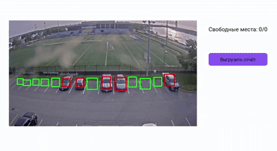
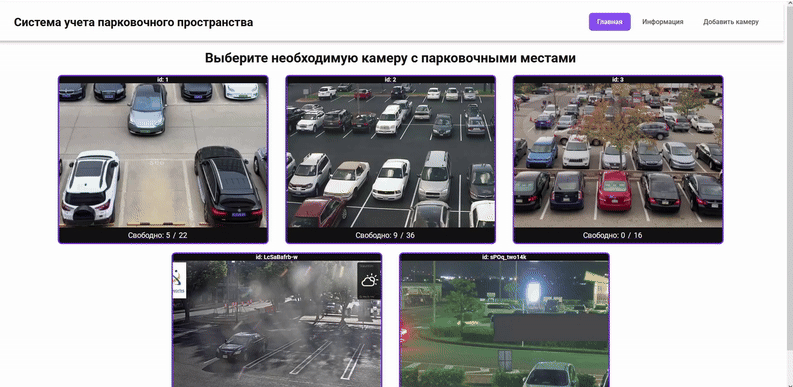
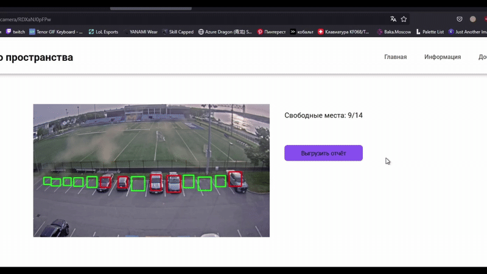
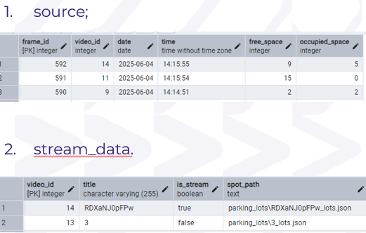
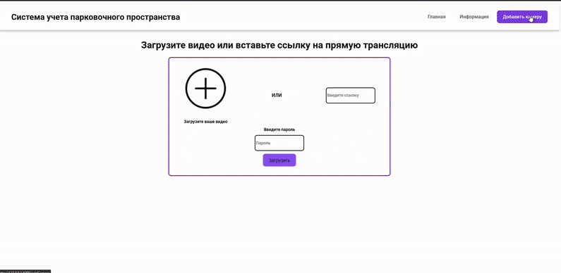

# Система учета парковочного пространства

Проект представляет собой веб-интерфейс, в котором можно отслеживать парковочные места при помощи камер видеонаблюдения в реальном времени.

Веб-интерфейс включает в себя следующие возможности:
- Просмотр парковочных зон с видеороликов и видеопотоков в реальном времени;
- Получение фоновой статистики о количестве свободных мест на главном экране по каждой камере;
- Выгрузка отчета по видеоролику или видеопотоку;
- Сохранение статистики по каждой камере в СУБД PostgreSQL;
- Загрузка видеоролика или видеопотока с последующей разметкой парковочных зон.

| Просмотр парковочных зон с видеороликов и видеопотоков в реальном времени; | Получение фоновой статистики о количестве свободных мест на главном экране по каждой камере | Выгрузка отчета по видеоролику или видеопотоку | Сохранение статистики по каждой камере в СУБД PostgreSQL | Загрузка видеоролика или видеопотока с последующей разметкой парковочных зон |
| -------------------------------------------------------------------------- | ------------------------------------------------------------------------------------------- | ---------------------------------------------- | -------------------------------------------------------- | ---------------------------------------------------------------------------- |
|                                                          |                                                                                   |                                  |                          |                                                              |

## Используемый стек технологий
- Язык программирования: Python;
- Нейронная сеть: Yolo11M, дообученная на наборе данных "Vehicle Detection and Management";
- Фремворк: Flask;
- СУБД: PostgreSQL;
- Библиотеки: OpenCV, Ultralytics, Psycopg2, OpenPyXL, Streamlink;
- Встроенные библиотеки: Io, Math, Json, Os.

## Установка
1. Клонируйте репозиторий

```bash
https://github.com/Danonwastaken/ParkingLotsDetection.git

```

2. Перейдите в директорию проекта

```bash
cd ParkingLotsDetection
```

3. Создайте виртуальное окружение

```bash
python -m venv venv

venv/Scripts/activate
```

4. Установите необходимые зависимости

```bash
pip install -r requirements.txt
```

**ВАЖНО**

5. Не забудьте создать БД и подключиться к ней
```bash
CREATE TABLE public.source ( 
	video_id SERIAL PRIMARY KEY, 
	title VARCHAR(255) NOT NULL, 
	is_stream BOOLEAN NOT NULL, 
	spot_path TEXT NOT NULL 
);

CREATE TABLE public.stream_data ( 
	frame_id SERIAL PRIMARY KEY, 
	video_id INTEGER NOT NULL REFERENCES source(video_id) ON DELETE CASCADE, 
	date DATE NOT NULL, 
	time TIME NOT NULL, 
	free_space INTEGER NOT NULL, 
	occupied_space INTEGER NOT NULL 
);

CREATE TABLE public.video_data ( 
	frame_id SERIAL PRIMARY KEY, 
	video_id INTEGER NOT NULL REFERENCES source(video_id) ON DELETE CASCADE, frame_number INTEGER NOT NULL, 
	date DATE NOT NULL, 
	free_space INTEGER NOT NULL, 
	occupied_space INTEGER NOT NULL 
);
```

6. Перед использованием поменяйте данные БД в utils.py на свои

```bash
def get_db_connection():
    conn = psycopg2.connect(
        host='host',
        database='database',
        user='user',
        password='password'
    )
    return conn
```


